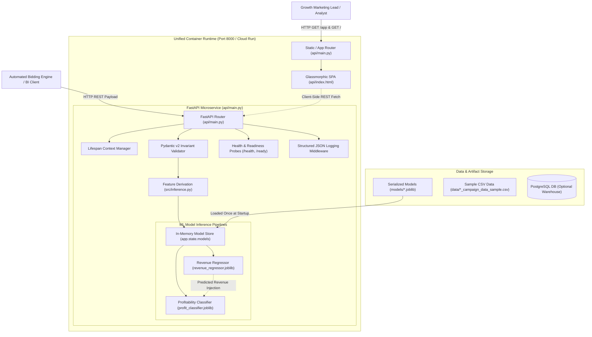

# Marketing Campaign Performance Analysis Architecture
Technical architecture, component layout, API schemas, container topology, and execution contracts for the Marketing Campaign Performance Analysis platform.

*Date: 2026-10-05*  
*Related Documents: [Mental Model](PROJECT_MENTAL_MODEL.md), [Specification](SPEC.md), [Decisions](DECISIONS.md), [Codebase Map](CODEBASE_MAP.md)*

---

## 1. Overview

The Marketing Campaign Performance Analysis system is an enterprise-grade machine learning microservice and interactive decision-support application designed for multi-brand e-commerce portfolios (Nykaa, Purplle, Tira). It provides growth marketing leads, media planners, and automated bidding systems with instant revenue forecasting and operational profitability classification before capital is deployed to paid advertising channels. The system serves pre-trained, frozen XGBoost pipelines through a low-latency FastAPI REST microservice utilizing in-memory lifespan singletons and strict boundary schema validation, unified with a high-performance dark-mode glassmorphic single-page web application served directly at `/app` via `api/index.html` on a single Uvicorn container. All architectural choices and trade-offs are documented in [Decisions](DECISIONS.md).

---

## 2. Technology Stack

- **Runtime & Language:** Python 3.13.2 (compatible with Python >= 3.10)
- **API & Web Serving Framework:** FastAPI 0.115.6 running on Uvicorn 0.32.1 (ASGI)
- **Schema Validation & Configuration:** Pydantic v2 (integrated with FastAPI), Pydantic Settings
- **Presentation Tier:** Vanilla HTML5 / CSS3 / JavaScript (ES6+) single-page application (`api/index.html`) featuring dark-mode glassmorphic design (`backdrop-filter: blur(16px)`), radial gradient glows, responsive slider controls, and client-side asynchronous REST fetching (eliminating Streamlit)
- **Machine Learning & Feature Engineering:**
  - Scikit-learn (pipelines, ColumnTransformer, preprocessing)
  - XGBoost (XGBRegressor for revenue forecasting, XGBClassifier for profitability prediction)
  - Imbalanced-learn (imbalance mitigation)
  - Pandas & NumPy (vectorized feature transformations)
  - Joblib (model pipeline serialization)
- **Database Storage:** PostgreSQL (raw historical metrics store via SQLAlchemy; fallback to local sample CSVs)
- **Automated Test Suite:** Pytest 8.3.4
- **Containerization & Deployment:** Single-process multi-stage OCI Dockerfile, Docker Compose, GCP Cloud Run (`asia-south1`)

---

## 3. Test Commands

The automated test suite enforces code quality, feature invariance, and API contract compliance. As documented in the test configuration, slow tests (such as full integration renders, heavy training routines, or container checks) must be marked with the registered `@pytest.mark.slow` decorator.

- **Full:**
  ```bash
  python -m pytest -q
  ```
- **Fast:**
  ```bash
  python -m pytest -q -m "not slow"
  ```
- **One file:**
  ```bash
  python -m pytest -q tests/test_api.py
  ```

---

## 4. Components



### Component Breakdown
- **FastAPI Router (`api/main.py`):** ASGI HTTP router handling single and batch inference endpoints, system health probes, and API documentation.
- **Static / App Router (`api/main.py`):** FastAPI endpoints serving the embedded glassmorphic SPA at `/app` (and `/app/`) with root redirect `/` -> `/app`.
- **Glassmorphic SPA (`api/index.html`):** Dark-mode single-page frontend with frosted-glass aesthetic (`backdrop-filter: blur(16px)`), dynamic sliders, INR currency formatting, and client-side REST invocation.
- **Lifespan Context Manager (`api/main.py`):** Asynchronous startup/shutdown handler that loads machine learning models into memory once, ensuring zero per-request disk reads.
- **In-Memory Model Store (`app.state.models`):** Process-level cache storing pre-warmed Scikit-learn / XGBoost pipeline singletons across the application lifecycle.
- **Pydantic v2 Invariant Validator (`api/main.py`):** Boundary validator enforcing mathematical invariants (`clicks <= impressions`, `conversions <= clicks`, `month in 1..12`, brand normalization) before pipeline invocation.
- **Feature Derivation Engine (`src/inference.py`):** Pure-function transformation module computing zero-safe derived ratios (`ctr`, `conversion_rate`, `cpl`), cyclical trigonometric month encodings, and one-hot channel indicators.
- **Revenue Regressor Pipeline (`models/revenue_regressor.joblib`):** Trained XGBoost regression pipeline predicting continuous campaign revenue in INR.
- **Profitability Classifier Pipeline (`models/profit_classifier.joblib`):** Trained XGBoost classification pipeline predicting binary campaign profitability status given campaign features and predicted revenue.
- **Probes & Logging Middleware (`api/main.py`):** Operational observability suite providing Kubernetes/Cloud Run compatible `/health` and `/ready` probes, along with structured JSON latency and audit logging.
- **Data & Artifact Store (`data/`, `models/`):** Version-controlled model binaries and fallback sample datasets enabling fully self-contained offline execution.

---

## 5. Data Models

All incoming request bodies, query parameters, and outgoing JSON responses are validated through strict Pydantic v2 models.

### 5.1 Campaign Input Schema (`CampaignInput`)

```python
from __future__ import annotations
from typing import Literal
from pydantic import BaseModel, Field, field_validator, model_validator

BrandType = Literal["nykaa", "purplle", "tira"]
CampaignType = Literal["Social Media", "Paid Ads", "Influencer", "Email", "SEO"]
TargetAudienceType = Literal["College Students", "Tier 2 City Customers", "Youth", "Working Women"]
CustomerSegmentType = Literal["College Students", "Premium Shoppers", "Working Women", "Tier 2 City Customers"]
LanguageType = Literal["English", "Hindi", "Tamil", "Bengali"]

class CampaignInput(BaseModel):
    brand: str = Field(default="nykaa", description="Target e-commerce brand (case-insensitive)")
    campaign_type: CampaignType = Field(default="Paid Ads", description="Marketing campaign strategy")
    target_audience: TargetAudienceType = Field(default="Youth", description="Demographic audience target")
    language: LanguageType = Field(default="English", description="Creative language context")
    customer_segment: CustomerSegmentType = Field(default="Premium Shoppers", description="Customer purchasing tier")
    month: int = Field(default=5, ge=1, le=12, description="Execution calendar month (1-12)")
    impressions: float = Field(default=50000.0, ge=0.0, description="Expected ad impressions")
    clicks: float = Field(default=4000.0, ge=0.0, description="Expected click volume")
    leads: float = Field(default=1500.0, ge=0.0, description="Projected inbound leads")
    conversions: float = Field(default=500.0, ge=0.0, description="Target customer conversions")
    engagement_score: float = Field(default=15.0, ge=0.0, description="Target engagement score (0-30)")
    acquisition_cost: float = Field(default=250.0, ge=0.0, description="Cost Per Acquisition in INR")
    channels: list[str] = Field(
        default_factory=lambda: ["Instagram", "Google"],
        description="Delivery channels (YouTube, Instagram, Google, WhatsApp, Email, Facebook)"
    )

    @field_validator("brand", mode="before")
    @classmethod
    def normalize_brand(cls, v: str) -> str:
        if isinstance(v, str):
            normalized = v.strip().lower()
            if normalized not in {"nykaa", "purplle", "tira"}:
                raise ValueError(f"Invalid brand '{v}'. Supported brands are: ['nykaa', 'purplle', 'tira']")
            return normalized
        raise ValueError("Brand must be a valid string")

    @model_validator(mode="after")
    def validate_logical_invariants(self) -> CampaignInput:
        if self.clicks > self.impressions:
            raise ValueError(
                f"Logical invariant violated: clicks ({self.clicks}) cannot exceed impressions ({self.impressions})"
            )
        if self.conversions > self.clicks:
            raise ValueError(
                f"Logical invariant violated: conversions ({self.conversions}) cannot exceed clicks ({self.clicks})"
            )
        if self.leads > self.clicks:
            raise ValueError(
                f"Logical invariant violated: leads ({self.leads}) cannot exceed clicks ({self.clicks})"
            )
        return self
```

### 5.2 Batch Prediction Schemas

```python
class BatchCampaignInput(BaseModel):
    items: list[CampaignInput] = Field(
        ...,
        min_length=1,
        max_length=500,
        description="List of campaign records for bulk evaluation (1 to 500 items)"
    )

class RevenuePredictionResponse(BaseModel):
    forecasted_revenue: float = Field(..., description="Projected gross revenue in INR")

class BatchRevenueResponse(BaseModel):
    predictions: list[float] = Field(..., description="Ordered list of predicted revenues in INR")
    total_items: int = Field(..., description="Total records evaluated in the batch")
    latency_ms: float = Field(..., description="Batch inference processing latency in milliseconds")

class ProfitabilityPredictionResponse(BaseModel):
    forecasted_revenue: float = Field(..., description="Projected gross revenue in INR")
    profitable: bool = Field(..., description="Binary classification flag indicating profitability")
    status: Literal["PROFITABLE", "LOSS"] = Field(..., description="Human-readable business outcome")

class BatchProfitabilityResponse(BaseModel):
    predictions: list[ProfitabilityPredictionResponse] = Field(..., description="Ordered list of profitability predictions")
    total_items: int = Field(..., description="Total records evaluated in the batch")
    latency_ms: float = Field(..., description="Batch inference processing latency in milliseconds")
```

### 5.3 Probes & Health Schemas

```python
class HealthResponse(BaseModel):
    status: str = Field(default="ok", description="Operational status flag")
    version: str = Field(default="1.0.0", description="Semantic microservice version")
    revenue_model: bool = Field(..., description="Indicates if revenue regressor is loaded in memory")
    profit_model: bool = Field(..., description="Indicates if profit classifier is loaded in memory")
    uptime_seconds: float = Field(..., description="Microservice continuous runtime in seconds")

class ReadinessResponse(BaseModel):
    status: Literal["ready", "unready"] = Field(..., description="Readiness status for ingress traffic")
    models_loaded: bool = Field(..., description="True if both inference models are pre-loaded")
    detail: str | None = Field(default=None, description="Diagnostic error detail if unready")
```

---

## 6. Interfaces

### 6.1 REST API Endpoints

| Method | Endpoint | Request Schema | Response Schema | Status Codes | Description |
|--------|----------|----------------|-----------------|--------------|-------------|
| `GET` | `/` | None | Redirect (`/app`) | `307` | Redirects root traffic to the interactive web application. |
| `GET` | `/app` | None | `text/html` | `200`, `404` | Serves the embedded dark-mode glassmorphic single-page web app. |
| `GET` | `/health` | None | `HealthResponse` | `200` | Liveness check reporting process uptime, version, and model flags. |
| `GET` | `/ready` | None | `ReadinessResponse` | `200`, `503` | Readiness check verifying models are loaded in `app.state`. |
| `POST` | `/forecast_revenue` | `CampaignInput` | `RevenuePredictionResponse` | `200`, `422`, `503` | Predicts expected gross revenue for a single campaign. |
| `POST` | `/predict_profitability` | `CampaignInput` | `ProfitabilityPredictionResponse` | `200`, `422`, `503` | Forecasts revenue and predicts binary profitability. |
| `POST` | `/forecast_revenue/batch` | `BatchCampaignInput` | `BatchRevenueResponse` | `200`, `422`, `503` | Vectorized revenue forecasting for up to 500 campaigns. |
| `POST` | `/predict_profitability/batch` | `BatchCampaignInput` | `BatchProfitabilityResponse` | `200`, `422`, `503` | Vectorized profitability classification for up to 500 campaigns. |

### 6.2 Core Python Signatures

- **Feature Engineering (`src/inference.py`):**
  ```python
  def build_campaign_row(payload: dict[str, Any]) -> tuple[pd.DataFrame, pd.DataFrame]:
      """Construct single-row regression and classification DataFrames with derived metrics."""
  
  def build_batch_campaign_rows(payloads: list[dict[str, Any]]) -> tuple[pd.DataFrame, pd.DataFrame]:
      """Construct vectorized multi-row regression and classification DataFrames for batch inference."""
  ```

- **Lifecycle & Model Loading (`api/main.py`):**
  ```python
  @asynccontextmanager
  async def lifespan(app: FastAPI) -> AsyncIterator[None]:
      """Load XGBoost models into app.state.models on startup; clear cache on shutdown."""
  ```

### 6.3 CLI & Operational Commands

- **Run Unified FastAPI Microservice & UI:**
  ```bash
  uvicorn api.main:app --host 0.0.0.0 --port 8000 --workers 1
  ```
- **Run via Docker:**
  ```bash
  docker run -p 8000:8000 marketing-campaign-analysis
  ```
- **Run Docker Compose Stack:**
  ```bash
  docker compose up --build
  ```

---

## 7. Directory Layout

```text
MarketingCampaignAnalysis/
├── .env.example                               # Environment template for ports, models, and DB credentials
├── .gitignore                                 # Git ignore patterns for caches, models, and local datasets
├── .dockerignore                              # Build exclusion rules for Docker OCI images
├── Dockerfile                                 # Multi-stage production container definition (single unified Uvicorn process)
├── docker-compose.yml                         # Container topology orchestrating unified microservice and optional DB
├── README.md                                  # Repository overview and quickstart guide
├── pytest.ini                                 # Pytest configuration with registered 'slow' marker
├── requirements.txt                           # Production and test Python dependencies (Streamlit eliminated)
├── .github/
│   └── workflows/
│       └── ci.yml                             # Automated GitHub Actions CI workflow
├── api/
│   ├── __init__.py                            # API package marker
│   ├── index.html                             # Dark-mode glassmorphic single-page web app served directly at /app
│   └── main.py                                # Lifespan model serving, Pydantic schemas, routes, /app UI server, probes
├── data/
│   ├── DATA_SETUP.md                          # Dataset resolution documentation
│   ├── queries.sql                            # SQL schema for raw campaign metrics
│   ├── nykaa_campaign_data_sample.csv         # Nykaa sample metrics
│   ├── nykaa_campaign_data_with_nulls.csv     # Imputation validation dataset
│   ├── purplle_campaign_data_sample.csv       # Purplle sample metrics
│   ├── purplle_campaign_data_with_nulls.csv   # Imputation validation dataset
│   ├── tira_campaign_data_sample.csv          # Tira sample metrics
│   └── tira_campaign_data_with_nulls.csv      # Imputation validation dataset
├── docs/
│   ├── SPEC.md                                # Production hardening specification
│   ├── PROJECT_MENTAL_MODEL.md                # Project context, milestones, and principles
│   ├── CODEBASE_MAP.md                        # Living architecture and baseline map
│   ├── ARCHITECTURE.md                        # Technical foundation and interface architecture (this document)
│   ├── DECISIONS.md                           # Architecture Decision Records (ADRs)
│   ├── DEMO.md                                # 5-minute showcase demonstration walkthrough
│   └── eda/                                   # Exploratory visual artifacts
│       ├── correlation_heatmap.png
│       ├── roi_by_campaign_type.png
│       └── roi_distribution.png
├── models/
│   ├── profit_classifier.joblib               # Serialized XGBoost classification pipeline
│   ├── revenue_regressor.joblib               # Serialized XGBoost regression pipeline
│   └── revenue_regressor_tuned.joblib         # Tuned regression variant
├── notebooks/
│   └── Marketing Campaign Performance Analysis.ipynb
├── reports/
│   ├── evaluation.md                          # Holdout validation report
│   └── metrics.json                           # Machine-readable evaluation metrics
├── scripts/
│   ├── export_evaluation.py                   # Evaluation report generation script
│   └── generate_eda.py                        # EDA figure export script
├── src/
│   ├── __init__.py                            # Core source package marker
│   ├── config.py                              # Pydantic BaseSettings environment configuration
│   ├── data_ingestion.py                      # Multi-brand CSV to PostgreSQL loader
│   ├── data_preprocessing.py                  # Cleaning, mode/median imputation, cyclical features
│   ├── db_config.py                           # SQLAlchemy engine configuration
│   ├── inference.py                           # Single and batch feature derivation routines
│   └── train_models.py                        # Model training and pipeline serialization
└── tests/
    ├── test_api.py                            # FastAPI route, lifespan, /app UI, and probe integration tests
    └── test_inference.py                      # Feature engineering, invariant, and batch unit tests
```

---

## 8. Configuration

Runtime behavior is managed through environment variables loaded via Pydantic `BaseSettings` (`src/config.py`). All variables can be configured via a `.env` file based on `.env.example`:

| Environment Variable | Default Value | Description |
|----------------------|---------------|-------------|
| `APP_ENV` | `production` | Deployment environment (`development`, `staging`, `production`). |
| `API_HOST` | `0.0.0.0` | Host binding interface for Uvicorn ASGI server. |
| `API_PORT` | `8000` | Port for the FastAPI microservice. |
| `PORT` | `8000` | Target port for Google Cloud Run container deployment. |
| `LOG_LEVEL` | `INFO` | Logging level (`DEBUG`, `INFO`, `WARNING`, `ERROR`). |
| `MODEL_DIR` | `models` | Directory path containing serialized `.joblib` model artifacts. |
| `DB_HOST` | `localhost` | Hostname for PostgreSQL instance (optional warehouse store). |
| `DB_PORT` | `5432` | Port for PostgreSQL instance. |
| `DB_NAME` | `marketing_campaign` | Database name for raw campaign metrics. |
| `DB_USER` | `postgres` | PostgreSQL username. |
| `DB_PASSWORD` | `""` | PostgreSQL password. |

---

## Setup requirements

### Tools
| Tool | Minimum Version | Verification Command |
|------|-----------------|----------------------|
| Python | 3.10.0 | `python --version` |
| Docker | 24.0.0 | `docker --version` |
| Docker Compose | 2.20.0 | `docker compose version` |
| Git | 2.30.0 | `git --version` |

### Accounts and credentials
| Service | Environment Variable | First Milestone | Where to Get It | Cost | Test Strategy Without Key |
|---------|----------------------|-----------------|-----------------|------|---------------------------|
| None | None | N/A | N/A | Free | All automated tests run fully offline with local model mocks or bundled `.joblib` artifacts. No paid keys or cloud credentials required. |

### Local services
| Service | Purpose | How to Start |
|---------|---------|--------------|
| None | Self-contained | Models and data fall back to local sample CSVs and serialized binaries. PostgreSQL is optional. |

---

## 10. Compatibility & Backwards Compatibility

1. **Existing REST API Contracts:**
   The single-campaign inference contracts `POST /forecast_revenue` and `POST /predict_profitability` remain strictly backwards-compatible with existing callers. The existing response schemas (`{"forecasted_revenue": <float>}` and `{"forecasted_revenue": <float>, "profitable": <bool>, "status": "PROFITABLE" | "LOSS"}`) are preserved.
2. **Health Endpoint Backward Compatibility:**
   `GET /health` continues to return `status: "ok"`, `revenue_model: bool`, and `profit_model: bool`, augmented with non-breaking fields `version` and `uptime_seconds`.
3. **Scikit-learn Compatibility Shim:**
   To maintain seamless deserialization across scikit-learn versions without unpickling errors, the backward compatibility shim for `sklearn.compose._column_transformer._RemainderColsList` is maintained in `api/main.py`.
4. **Feature Derivation Invariance:**
   The return type of `build_campaign_row(payload)` remains `tuple[pd.DataFrame, pd.DataFrame]`, ensuring all 10 existing baseline unit and API tests pass without regression.
5. **Streamlit Elimination & UI Unification:**
   The legacy Streamlit application (`app/app.py`) is completely decommissioned in favor of the embedded SPA at `/app`. All interactive forecasting and profitability evaluations are fulfilled by the existing FastAPI REST routes, maintaining full functional parity while eliminating dual-runtime orchestration.
